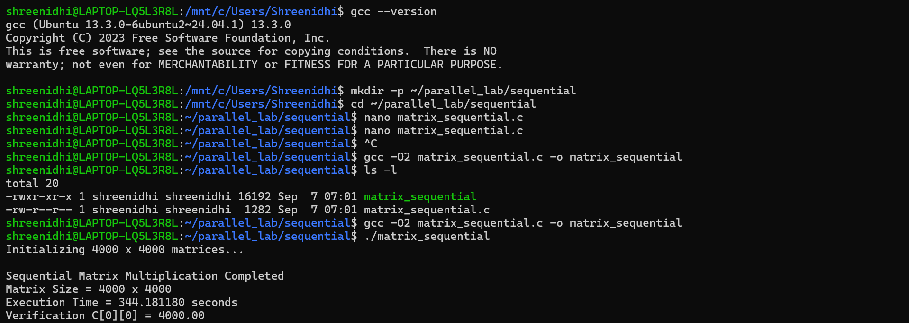

# Experiment 01 - Sequential Matrix Multiplication

**Course:** Parallel Computing and GPU
**Platform:** Ubuntu 24.04.1 LTS on WSL2
**Device:** Lenovo Yoga Series Laptop

---

## 1. Objective

Implement and benchmark a sequential (single-threaded) matrix multiplication of two 4000 x 4000 matrices to establish a baseline for comparison with OpenMP, MPI, and GPU-based implementations.

## 2. System Info

|              |                            |
| ------------ | -------------------------- |
| Device       | Lenovo Yoga Series Laptop  |
| CPU          | Intel/AMD processor        |
| OS           | Ubuntu 24.04.1 LTS on WSL2 |
| Compiler     | GCC 13.3                   |
| Architecture | x86_64                     |

## 3. Adaptation Note

The experiment was implemented using Ubuntu 24.04.1 LTS running on WSL2 on a Lenovo Yoga Series laptop.

The program was compiled and executed using GCC on Ubuntu. No VirtualBox or VMware virtual machine was used.

## 4. Source Code

`matrix_sequential.c`:

```c
#include <stdio.h>
#include <stdlib.h>
#include <time.h>

#define N 4000

int main(void)
{
    double *A = malloc(sizeof(double) * (size_t)N * N);
    double *B = malloc(sizeof(double) * (size_t)N * N);
    double *C = malloc(sizeof(double) * (size_t)N * N);

    if (!A || !B || !C)
    {
        fprintf(stderr, "Memory allocation failed\n");
        return 1;
    }

    for (long i = 0; i < (long)N * N; i++)
    {
        A[i] = 1.0;
        B[i] = 1.0;
    }

    struct timespec start, end;
    clock_gettime(CLOCK_MONOTONIC, &start);

    for (int i = 0; i < N; i++)
    {
        for (int j = 0; j < N; j++)
        {
            double sum = 0.0;

            for (int k = 0; k < N; k++)
            {
                sum += A[i * N + k] * B[k * N + j];
            }

            C[i * N + j] = sum;
        }
    }

    clock_gettime(CLOCK_MONOTONIC, &end);

    double elapsed =
        (end.tv_sec - start.tv_sec) +
        (end.tv_nsec - start.tv_nsec) / 1e9;

    printf("Sequential Matrix Multiplication (%d x %d)\n", N, N);
    printf("Execution time: %f seconds\n", elapsed);
    printf("C[0][0] = %.2f\n", C[0]);

    free(A);
    free(B);
    free(C);

    return 0;
}
```

## 5. Compilation

```bash
gcc -O2 matrix_sequential.c -o matrix_sequential
```

## 6. Execution

```bash
./matrix_sequential
```

## 7. Result

```text
Matrix Size = 4000 x 4000
Execution Time = 344.181180 seconds
Verification C[0][0] = 4000.00
```

## 8. Verification

Every element of matrices A and B is initialized to 1.0.

Therefore:

```text
C[0][0] = 1*1 + 1*1 + ... + 1*1
```

There are 4000 terms.

Hence:

```text
C[0][0] = 4000.00
```

The result is verified successfully.

## 9. Screenshot



*Terminal showing the sequential matrix multiplication result and execution time.*

## 10. Observations

* Matrix size used: 4000 x 4000
* Execution time: 344.181180 seconds
* Verification value: C[0][0] = 4000.00
* The sequential implementation is used as the baseline for comparison with parallel implementations.

## 11. Complexity

* Time Complexity: O(N^3)
* Space Complexity: O(N^2)

## 12. Conclusion

The sequential matrix multiplication program successfully multiplied two 4000 x 4000 matrices using C on Ubuntu WSL2. The execution time was 344.181180 seconds, and the result was verified using C[0][0] = 4000.00.
