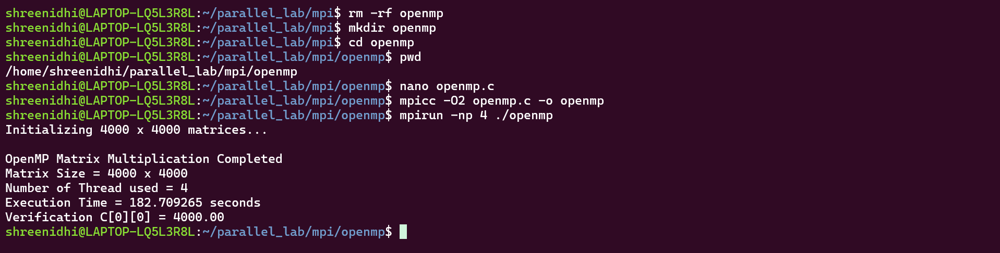

# Experiment 02 - OpenMP Matrix Multiplication

**Course:** Parallel Computing and GPU
**Platform:** Ubuntu 24.04.1 LTS on WSL2
**Device:** Lenovo Yoga Series Laptop

---

## 1. Objective

To implement and execute matrix multiplication using OpenMP shared-memory parallelism, measure the execution time, and verify the correctness of the result.

## 2. Problem Definition

Two matrices A and B of size 4000 x 4000 are initialized with all elements equal to 1.0.

The result matrix C is calculated as:

```text
C = A × B
```

Since every element of A and B is 1.0:

```text
C[i][j] = 1 + 1 + ... + 1
```

There are 4000 terms, therefore:

```text
C[0][0] = 4000.00
```

## 3. System / Environment

|                    |                            |
| ------------------ | -------------------------- |
| Device             | Lenovo Yoga Series Laptop  |
| Operating System   | Ubuntu 24.04.1 LTS on WSL2 |
| Compiler           | GCC 13.3                   |
| Architecture       | x86_64                     |
| Parallel Framework | OpenMP                     |
| Matrix Size        | 4000 x 4000                |

## 4. OpenMP

OpenMP is an API used for shared-memory parallel programming.

In this experiment, OpenMP distributes the iterations of the outer matrix row loop among multiple CPU threads.

The matrices are stored in shared memory, while different threads perform calculations for different rows.

## 5. Algorithm

1. Initialize matrices A and B.
2. Set every element of A and B to 1.0.
3. Allocate memory for the result matrix C.
4. Start the execution timer.
5. Use OpenMP to parallelize the outer matrix multiplication loop.
6. Calculate the elements of matrix C.
7. Stop the timer.
8. Display the execution time.
9. Verify the result using C[0][0].
10. Free the allocated memory.

## 6. OpenMP Source Code

The OpenMP implementation uses the following directive:

```c
#pragma omp parallel for
```

This distributes the iterations of the outer loop among multiple threads.

The OpenMP timing function is:

```c
omp_get_wtime()
```

### Main OpenMP Logic

```c
#pragma omp parallel for private(j, k)
for (i = 0; i < N; i++)
{
    for (j = 0; j < N; j++)
    {
        for (k = 0; k < N; k++)
        {
            C[i * N + j] +=
                A[i * N + k] *
                B[k * N + j];
        }
    }
}
```

## 7. Compilation

The program is compiled using GCC with OpenMP support:

```bash
gcc -O2 -fopenmp matrix_openmp.c -o matrix_openmp
```

### Explanation

* `gcc` - GCC compiler
* `-O2` - compiler optimization
* `-fopenmp` - enables OpenMP support
* `matrix_openmp.c` - source file
* `-o matrix_openmp` - creates the executable

## 8. Execution

The program is executed using:

```bash
./matrix_openmp
```

## 9. Result

The OpenMP execution result is recorded in the screenshot below.



The program successfully performs matrix multiplication and verifies the result.

## 10. Verification

The correctness of the multiplication is verified using:

```text
C[0][0] = 4000.00
```

Every element of matrices A and B is initialized to 1.0.

Therefore:

```text
C[0][0] = 1×1 + 1×1 + ... + 1×1
```

There are 4000 terms.

Hence:

```text
C[0][0] = 4000.00
```

The result is verified successfully.

## 11. Performance

OpenMP uses multiple CPU threads to execute independent iterations of the matrix multiplication in parallel.

The execution time obtained from the OpenMP experiment is recorded in the result screenshot.

The sequential implementation is used as the baseline for performance comparison.

## 12. Complexity

* Time Complexity: O(N^3)
* Space Complexity: O(N^2)

OpenMP provides parallel execution but does not change the basic computational complexity of matrix multiplication.

## 13. Sequential vs OpenMP

| Implementation | Execution Method          | Verification      |
| -------------- | ------------------------- | ----------------- |
| Sequential     | Single CPU execution flow | C[0][0] = 4000.00 |
| OpenMP         | Multiple CPU threads      | C[0][0] = 4000.00 |

The OpenMP implementation uses thread-level parallelism to reduce the execution time compared with sequential execution.

## 14. Screenshot

The result screenshot for this experiment is stored at:

```text
pgc/exp-02-openmp/screenshots/01-openmp-result.png
```

It contains the OpenMP execution result and verification.

## 15. Conclusion

The 4000 x 4000 matrix multiplication was successfully implemented using OpenMP on Ubuntu 24.04.1 LTS running on WSL2 on a Lenovo Yoga Series laptop.

OpenMP was used to distribute matrix multiplication work among multiple CPU threads. The correctness of the computation was verified using:

```text
C[0][0] = 4000.00
```

The OpenMP implementation provides a parallel CPU approach that can be compared with the sequential and MPI implementations in the following experiments.
