# EXP-03 — MPI Matrix Multiplication

## Distributed-Memory Matrix Multiplication Using Open MPI


---

## 1. Aim

To implement and execute **distributed-memory matrix multiplication using MPI** and compare the execution of multiple MPI processes across four Ubuntu WSL2 instances.

---

## 2. System Configuration

| Component          | Details                   |
| ------------------ | ------------------------- |
| Device             | Lenovo Yoga Series Laptop |
| Operating System   | Ubuntu 24.04.1 LTS        |
| Environment        | WSL2                      |
| Architecture       | x86_64                    |
| Compiler           | GCC 13.3                  |
| MPI Implementation | Open MPI 4.1.6            |
| MPI Processes      | 4                         |
| Matrix Size        | 4000 × 4000               |

---

## 3. MPI Node Configuration

The experiment uses four Ubuntu WSL2 instances:

* **Master** — `master`
* **Worker 1** — `worker1`
* **Worker 2** — `worker2`
* **Worker 3** — `worker3`

Each node participates in the distributed MPI execution.

---

## 4. Master and Worker IP Addresses

The IP addresses of the master and worker instances were identified before configuring MPI communication.

### Master IP

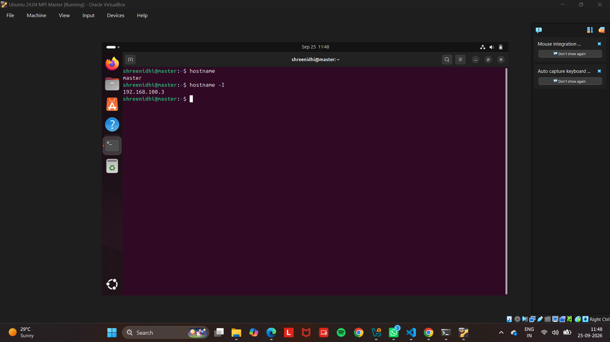

### Worker 1 IP

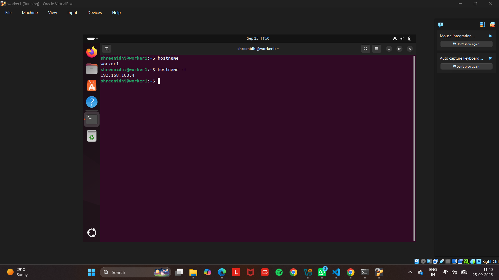

### Worker 2 IP

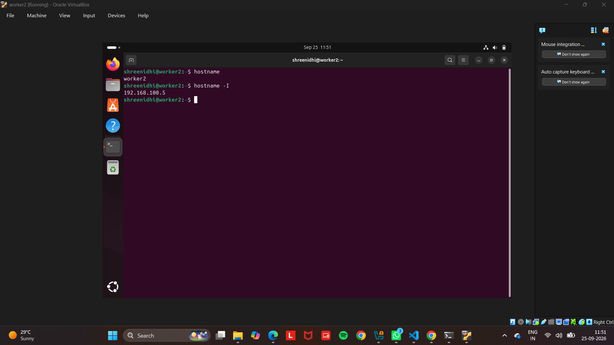

### Worker 3 IP

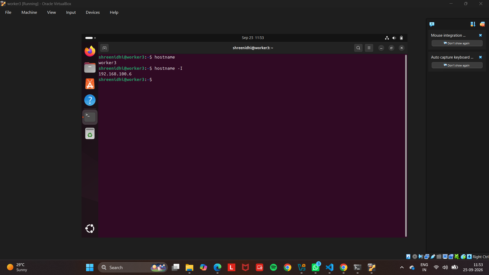

---

## 5. Network Connectivity

Connectivity between the master and worker nodes was verified using the `ping` command.

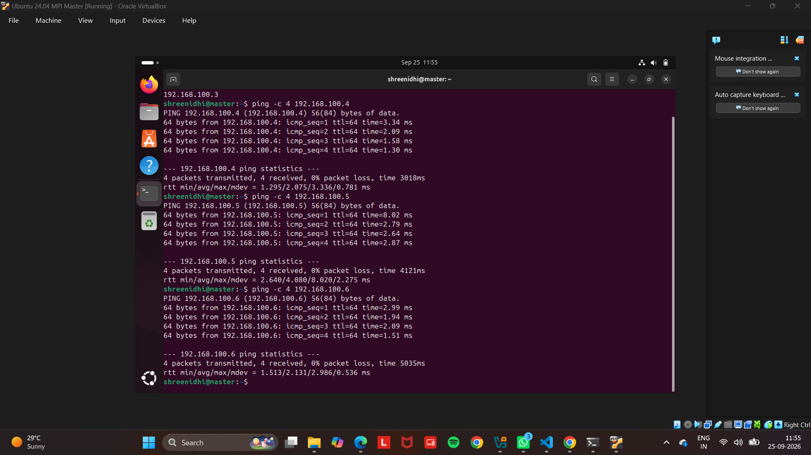

Successful ping responses confirm network connectivity between the MPI nodes.

---

## 6. SSH Configuration

SSH connectivity was configured between the master and worker nodes.

### SSH to Worker 1


### SSH to Worker 2


### SSH to Worker 3

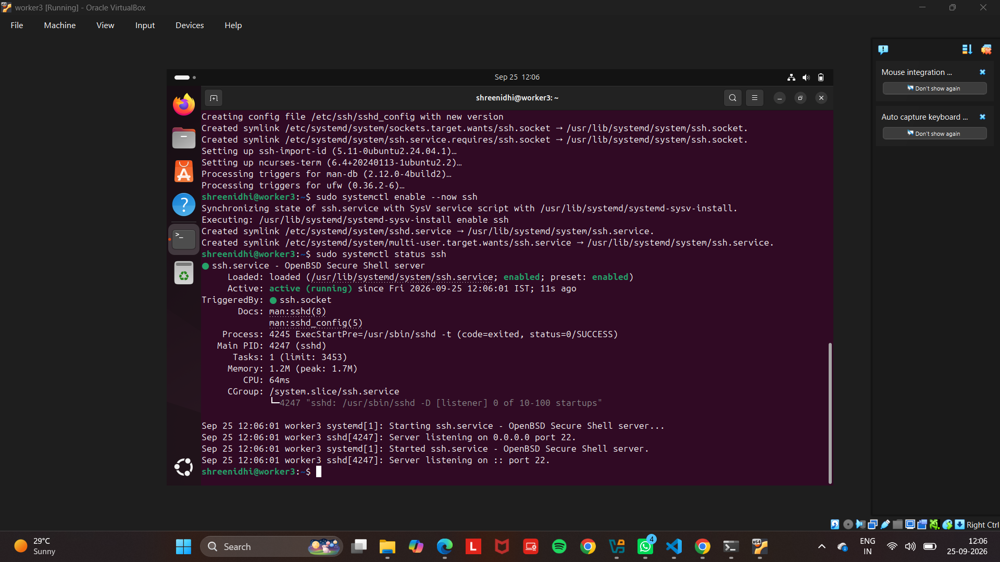

---

## 7. Passwordless SSH

Passwordless SSH was configured so that the master node could access the worker nodes without repeatedly entering a password.

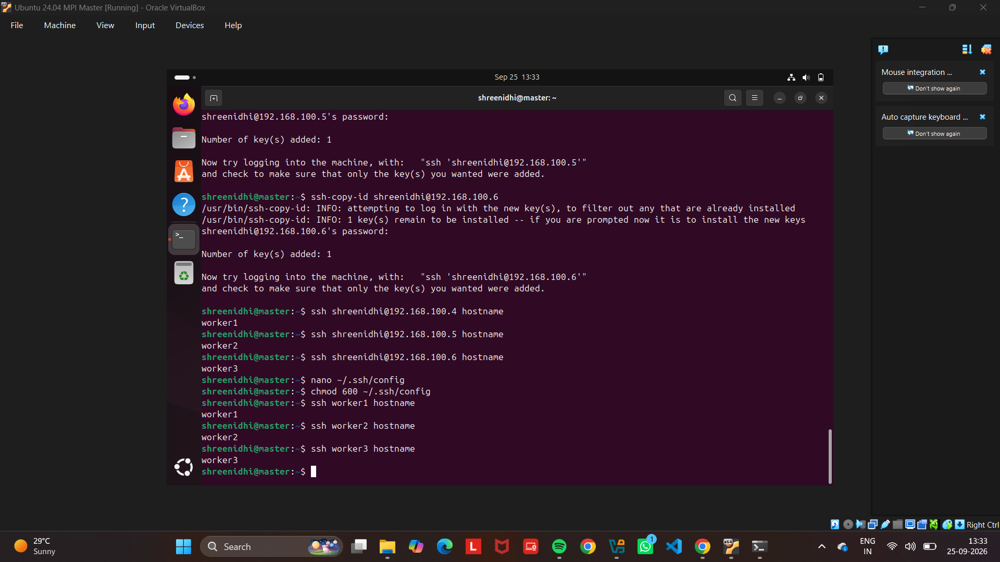

This allows MPI to launch processes on the worker nodes automatically.

---

## 8. Open MPI Installation

Open MPI and the MPI compiler were installed and verified on the Ubuntu environment.

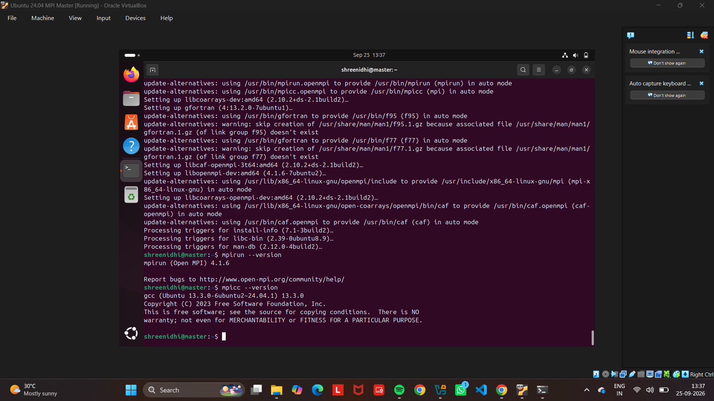

The important MPI commands used are:

```bash
mpicc --version
mpirun --version
```

---

## 9. MPI Hostfile

A hostfile was created to specify the MPI nodes and the number of available process slots.

```text
master slots=1
worker1 slots=1
worker2 slots=1
worker3 slots=1
```

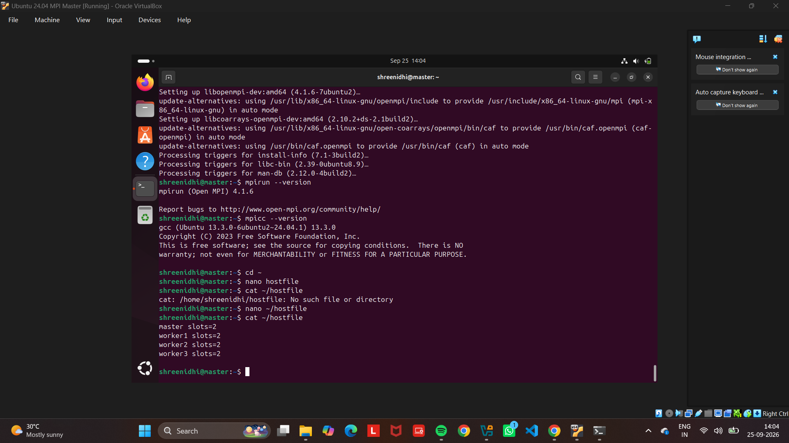

The hostfile allows MPI to distribute processes across the configured nodes.

---

## 10. MPI Four-Node Test

MPI communication was tested using four processes.

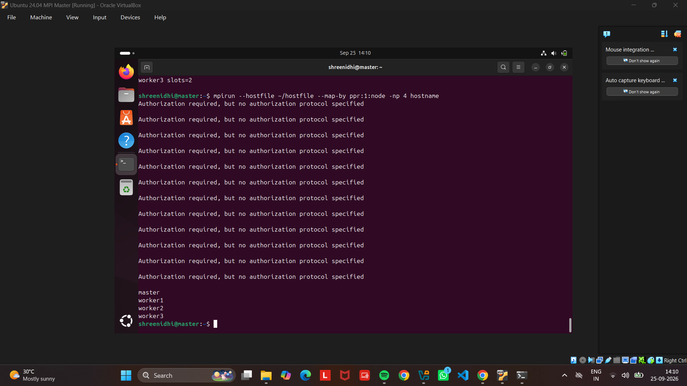

The test verifies that MPI can launch processes across:

```text
master
worker1
worker2
worker3
```

---

## 11. Matrix Multiplication

The matrix multiplication program performs multiplication of two 4000 × 4000 matrices.

The MPI implementation uses:

* `MPI_Init()`
* `MPI_Comm_rank()`
* `MPI_Comm_size()`
* `MPI_Scatter()`
* `MPI_Bcast()`
* `MPI_Gather()`
* `MPI_Wtime()`
* `MPI_Finalize()`

The matrix data is distributed among MPI processes, computation is performed in parallel, and the resulting matrix is collected by the master process.

---

## 12. Compilation

The MPI program is compiled using:

```bash
mpicc -O2 matrix_mpi.c -o matrix_mpi
```

The generated executable is:

```text
matrix_mpi
```

---

## 13. Execution

The program is executed using four MPI processes:

```bash
mpirun -np 4 --hostfile hostfile ./matrix_mpi
```

Four MPI processes are used for the experiment.

---

## 14. Final MPI Result

The final execution performs matrix multiplication using four MPI processes.

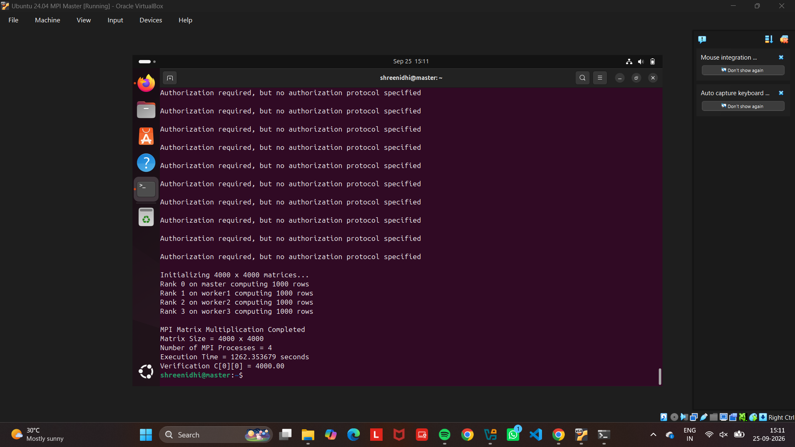

The output verifies:

* MPI matrix multiplication completed successfully.
* Matrix size is **4000 × 4000**.
* **4 MPI processes** were used.
* Execution time is displayed in seconds.
* `C[0][0] = 4000.00` confirms the correctness of the computation.

---

## 15. Result

The distributed-memory matrix multiplication was successfully implemented using **Open MPI** across four Ubuntu WSL2 instances.

The result was verified using:

```text
C[0][0] = 4000.00
```

Thus, the MPI-based matrix multiplication was successfully executed using four MPI processes.

---

## 16. Conclusion

MPI was successfully used to implement distributed-memory matrix multiplication. The master and worker nodes communicated through SSH, MPI processes were distributed using the hostfile, and the 4000 × 4000 matrix multiplication was completed successfully using four MPI processes.
