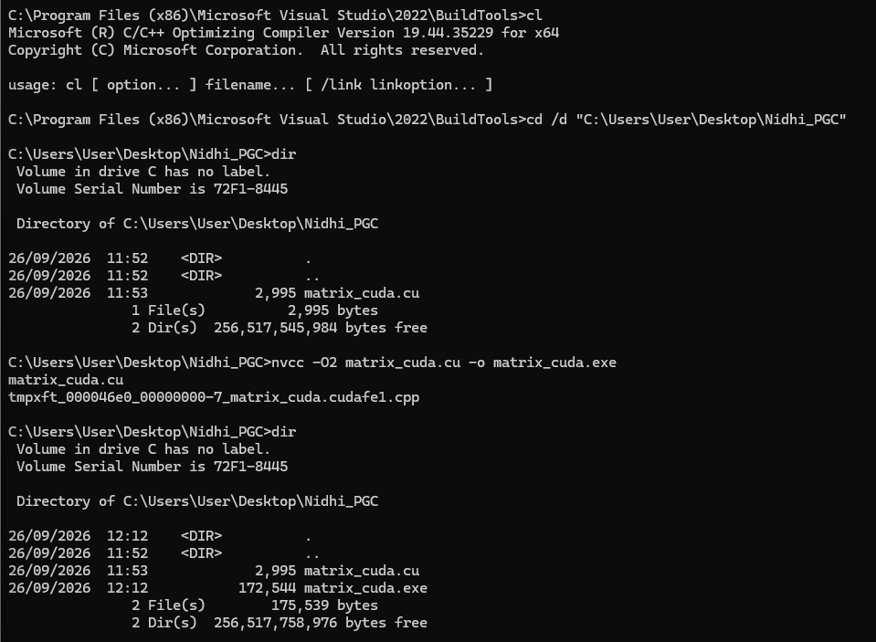
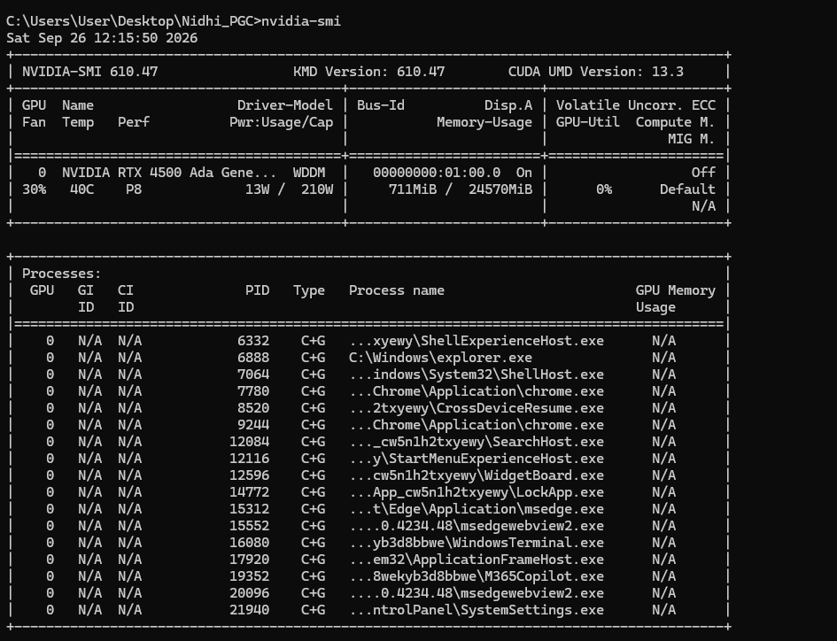
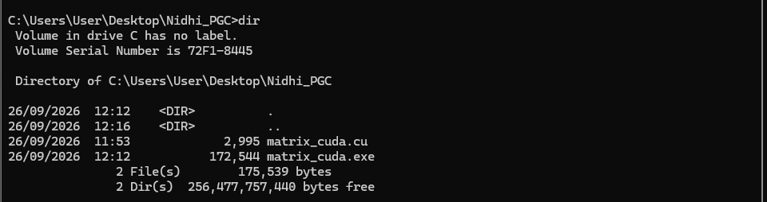
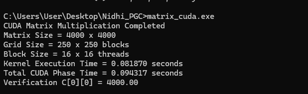

# EXP-04 — CUDA Matrix Multiplication

## CUDA-Based Matrix Multiplication Using GPU


---

## 1. Aim

To implement matrix multiplication using CUDA and execute the computation on an NVIDIA GPU using CUDA threads and blocks.

---

## 2. System Configuration

| Component         | Details                   |
| ----------------- | ------------------------- |
| Device            | Lenovo Yoga Series Laptop |
| Operating System  | Ubuntu 24.04.1 LTS / WSL2 |
| Architecture      | x86_64                    |
| Programming Model | CUDA                      |
| Matrix Size       | 4000 × 4000               |
| Block Size        | 16 × 16 threads           |

---

## 3. CUDA Program

The CUDA program performs multiplication of two **4000 × 4000 matrices**.

The program contains:

* Host memory allocation
* Device memory allocation using `cudaMalloc()`
* Data transfer using `cudaMemcpy()`
* CUDA kernel for matrix multiplication
* Thread and block configuration
* CUDA event-based execution timing
* Result verification

### Source Code

```text
code/matrix_cuda.cu
```

---

## 4. CUDA Matrix Multiplication Kernel

The CUDA kernel calculates one element of the result matrix for each CUDA thread.

The row and column are calculated using:

```c
int row = blockIdx.y * blockDim.y + threadIdx.y;
int col = blockIdx.x * blockDim.x + threadIdx.x;
```

Each CUDA thread computes one element of matrix `C`.

---

## 5. Thread and Block Configuration

The program uses:

```text
Block Size = 16 × 16 threads
```

The grid size is calculated based on the matrix size:

```c
dim3 grid((N + block.x - 1) / block.x,
          (N + block.y - 1) / block.y);
```

For a **4000 × 4000 matrix** and **16 × 16 threads per block**, the grid contains:

```text
250 × 250 blocks
```

Thus, the GPU launches enough threads to process the complete matrix.

---

## 6. CUDA Compilation

The CUDA program was compiled using the NVIDIA CUDA compiler:

```bash
nvcc matrix_cuda.cu -o matrix_cuda
```

### Compilation Result



---

## 7. NVIDIA GPU Verification

The NVIDIA GPU was verified using:

```bash
nvidia-smi
```

### NVIDIA GPU Information



This confirms that the NVIDIA GPU is available for CUDA execution.

---

## 8. CUDA Program Files

The CUDA source file and executable used for the experiment are shown below.



---

## 9. CUDA Execution

The CUDA matrix multiplication program was executed on the NVIDIA GPU.

The program displays:

* Matrix size
* Grid size
* Block size
* Kernel execution time
* Total CUDA phase time
* Verification result

### Execution Result



---

## 10. Result

The CUDA matrix multiplication was successfully executed for a:

```text
4000 × 4000
```

matrix.

The result was verified using:

```text
C[0][0] = 4000.00
```

The execution output also displays the CUDA grid configuration, block configuration, kernel execution time, and total CUDA phase time.

---

## 11. Conclusion

CUDA was successfully used to implement GPU-based matrix multiplication.

The computation was distributed among CUDA threads and blocks, and the result was successfully verified using:

```text
C[0][0] = 4000.00
```

The experiment demonstrates the use of GPU parallelism for performing large-scale matrix multiplication.
