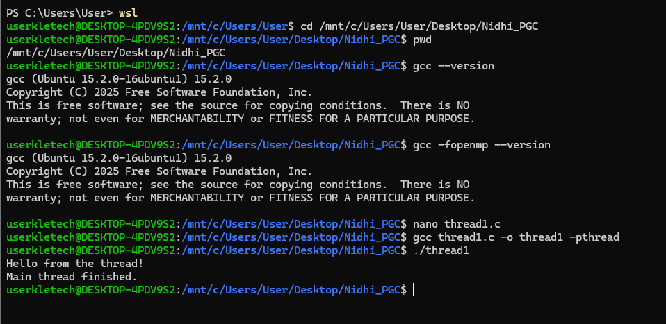
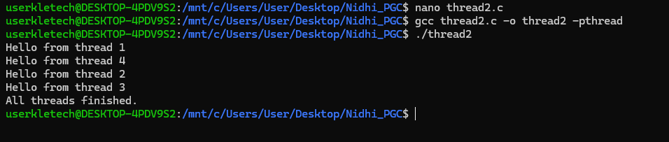
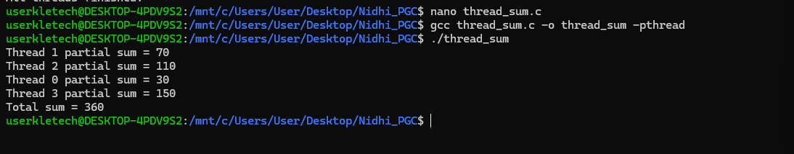
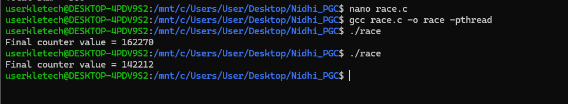
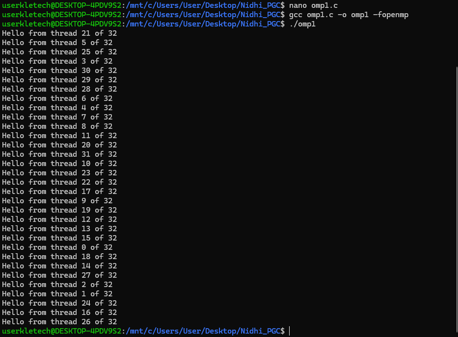
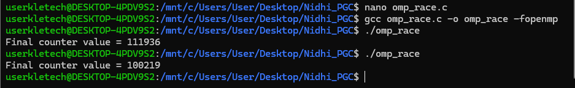
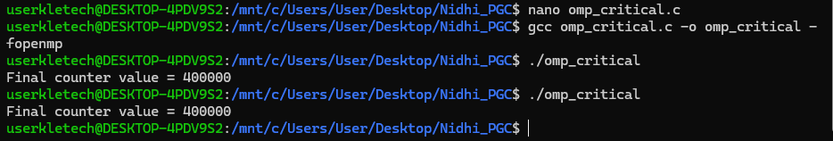
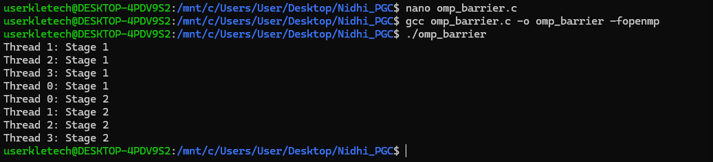
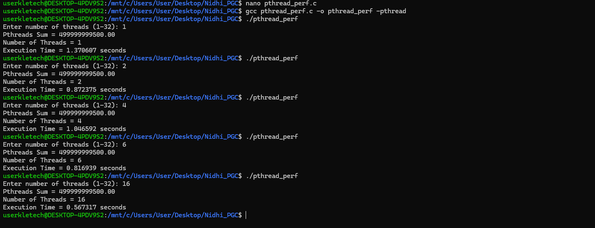
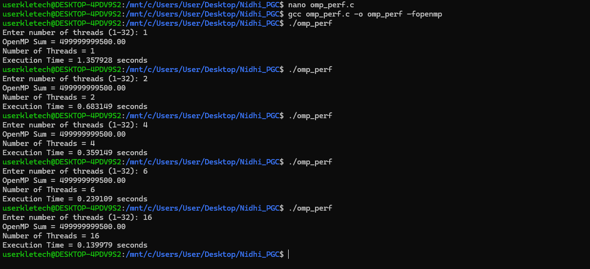

# EXP-05 — Thread Programming

## Pthreads and OpenMP Thread Programming


---

## 1. Aim

To implement and analyze thread-based parallel programming using **POSIX Threads (Pthreads)** and **OpenMP**, including thread creation, parallel computation, synchronization, race conditions, and performance comparison.

---

## 2. Objectives

The experiment demonstrates:

* Basic thread creation using Pthreads
* Multiple thread creation
* Parallel array summation
* Race conditions
* Mutex synchronization
* Basic OpenMP parallel programming
* OpenMP reduction
* OpenMP critical section
* OpenMP barrier synchronization
* Performance comparison between sequential, Pthreads, and OpenMP execution

---

## 3. System Configuration

| Component            | Details                   |
| -------------------- | ------------------------- |
| Device               | Lenovo Yoga Series Laptop |
| Operating System     | Ubuntu 24.04.1 LTS / WSL2 |
| Architecture         | x86_64                    |
| Programming Language | C                         |
| Threading Models     | Pthreads and OpenMP       |
| Compiler             | GCC                       |

---

# 4. Pthreads Programming

## 4.1 Basic Thread Creation

The first program demonstrates the creation of a single thread using the POSIX Threads library.

The program uses:

* `pthread_create()` to create a thread
* `pthread_join()` to wait for the thread
* A thread function to perform the task

### Source Code

```text
code/01-pthread/01-thread1.c
```

### Execution Result



---

## 4.2 Multiple Thread Creation

The second program creates multiple threads and assigns a unique ID to each thread.

Four threads are created and executed concurrently.

The program uses:

* `pthread_create()`
* `pthread_join()`
* Thread IDs

### Source Code

```text
code/01-pthread/02-thread2.c
```

### Execution Result



---

## 4.3 Parallel Array Summation Using Pthreads

The array is divided among multiple threads.

Each thread calculates the sum of its assigned portion of the array. The partial sums are then combined to obtain the total sum.

### Source Code

```text
code/01-pthread/03-thread-sum.c
```

### Execution Result



---

## 4.4 Race Condition Using Pthreads

A race condition occurs when multiple threads access and modify shared data simultaneously without proper synchronization.

In this program, multiple threads increment a shared counter.

The expected value is:

```text
4 × 100000 = 400000
```

However, because the counter is accessed concurrently without synchronization, the final value may differ from the expected value.

### Source Code

```text
code/01-pthread/04-race.c
```

### Execution Result



---

## 4.5 Mutex Synchronization

A mutex is used to protect the shared counter from simultaneous access by multiple threads.

The critical operation is protected using:

```c
pthread_mutex_lock();
pthread_mutex_unlock();
```

This ensures that only one thread modifies the shared counter at a time.

### Source Code

```text
code/01-pthread/05-mutex.c
```

### Execution Result


---

# 5. OpenMP Programming

## 5.1 Basic OpenMP Parallel Program

The first OpenMP program demonstrates the creation of a parallel region using:

```c
#pragma omp parallel
```

Each thread prints its thread ID and the total number of threads.

### Source Code

```text
code/02-openmp/omp1.c
```

### Execution Result



---

## 5.2 Parallel Array Summation Using OpenMP

OpenMP is used to perform parallel array summation.

The `reduction` clause is used to safely combine the partial results generated by different threads.

```c
#pragma omp parallel for reduction(+:total_sum)
```

### Source Code

```text
code/02-openmp/omp_sum.c
```

### Execution Result


---

## 5.3 OpenMP Race Condition

This program demonstrates a race condition when multiple OpenMP threads modify a shared counter without synchronization.

### Source Code

```text
code/02-openmp/omp_race.c
```

### Execution Result



---

## 5.4 OpenMP Critical Section

The `critical` directive is used to ensure that only one thread executes the protected section at a time.

```c
#pragma omp critical
```

This prevents simultaneous modification of the shared counter.

### Source Code

```text
code/02-openmp/omp_critical.c
```

### Execution Result



---

## 5.5 OpenMP Barrier Synchronization

The `barrier` directive synchronizes all threads at a specific point.

```c
#pragma omp barrier
```

A thread cannot proceed beyond the barrier until all other threads reach the same point.

### Source Code

```text
code/02-openmp/omp_barrier.c
```

### Execution Result



---

# 6. Performance Comparison

This section compares sequential execution with Pthreads and OpenMP implementations.

## 6.1 Sequential Execution

The sequential program performs the computation using a single execution flow without parallel threads.

### Source Code

```text
code/03-performance/sequential.c
```

### Execution Result


---

## 6.2 Pthreads Performance

The Pthreads implementation divides the computation among multiple threads.

The number of threads is provided as input during execution.

### Source Code

```text
code/03-performance/pthread_perf.c
```

### Execution Result



---

## 6.3 OpenMP Performance

The OpenMP implementation uses the `parallel for` directive to distribute loop iterations among multiple threads.

The number of threads is provided as input during execution.

### Source Code

```text
code/03-performance/omp_perf.c
```

### Execution Result



---

# 7. Thread Synchronization Concepts

| Program              | Concept Demonstrated              |
| -------------------- | --------------------------------- |
| Thread 1             | Basic thread creation             |
| Thread 2             | Multiple thread creation          |
| Thread Sum           | Parallel computation              |
| Race                 | Race condition                    |
| Mutex                | Mutual exclusion                  |
| OpenMP Basic         | Parallel region                   |
| OpenMP Sum           | Reduction                         |
| OpenMP Race          | Race condition                    |
| OpenMP Critical      | Critical section                  |
| OpenMP Barrier       | Thread synchronization            |
| Sequential           | Sequential execution              |
| Pthreads Performance | Parallel execution using Pthreads |
| OpenMP Performance   | Parallel execution using OpenMP   |

---

# 8. Compilation Commands

## 8.1 Pthreads

```bash
gcc thread1.c -o thread1 -pthread
gcc thread2.c -o thread2 -pthread
gcc thread_sum.c -o thread_sum -pthread
gcc race.c -o race -pthread
gcc mutex.c -o mutex -pthread
```

## 8.2 OpenMP

```bash
gcc omp1.c -o omp1 -fopenmp
gcc omp_sum.c -o omp_sum -fopenmp
gcc omp_race.c -o omp_race -fopenmp
gcc omp_critical.c -o omp_critical -fopenmp
gcc omp_barrier.c -o omp_barrier -fopenmp
```

## 8.3 Performance Programs

```bash
gcc sequential.c -o sequential
gcc pthread_perf.c -o pthread_perf -pthread
gcc omp_perf.c -o omp_perf -fopenmp
```

---

# 9. Important Observations

* Pthreads provides explicit control over thread creation and synchronization.
* OpenMP simplifies parallel programming using compiler directives.
* Race conditions can occur when multiple threads modify shared data without synchronization.
* Mutexes provide mutual exclusion for shared resources.
* OpenMP `critical` sections protect shared operations.
* OpenMP `barrier` synchronizes threads at a specific point.
* OpenMP `reduction` safely combines partial results.
* Parallel execution can reduce computation time depending on the workload and number of threads.

---

# 10. Experiment Structure

```text
exp-05-thread-programming/
│
├── code/
│   ├── 01-pthread/
│   │   ├── 01-thread1.c
│   │   ├── 02-thread2.c
│   │   ├── 03-thread-sum.c
│   │   ├── 04-race.c
│   │   └── 05-mutex.c
│   │
│   ├── 02-openmp/
│   │   ├── omp1.c
│   │   ├── omp_sum.c
│   │   ├── omp_race.c
│   │   ├── omp_critical.c
│   │   └── omp_barrier.c
│   │
│   └── 03-performance/
│       ├── sequential.c
│       ├── pthread_perf.c
│       └── omp_perf.c
│
├── screenshots/
│   ├── 01-pthread/
│   ├── 02-openmp/
│   └── 03-performance/
│
└── 05-Thread-Programming.md
```

---

# 11. Result

The thread programming experiments were successfully implemented using **Pthreads and OpenMP**.

The experiments demonstrated thread creation, parallel computation, race conditions, synchronization mechanisms, and performance comparison between sequential and parallel execution.

---

# 12. Conclusion

Pthreads and OpenMP were successfully used to implement thread-based parallel programs.

The experiments demonstrated important concepts such as **thread creation, parallel computation, race conditions, mutex synchronization, critical sections, barriers, reduction, and performance measurement**.

These experiments provide a practical understanding of shared-memory parallel programming using C.
